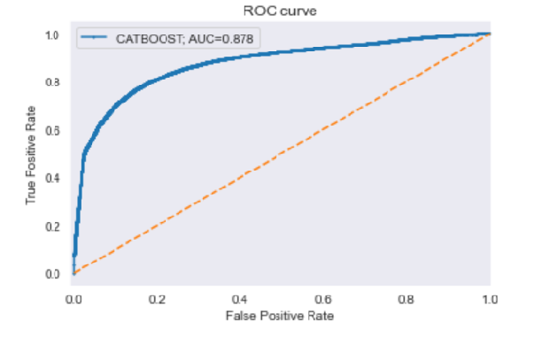
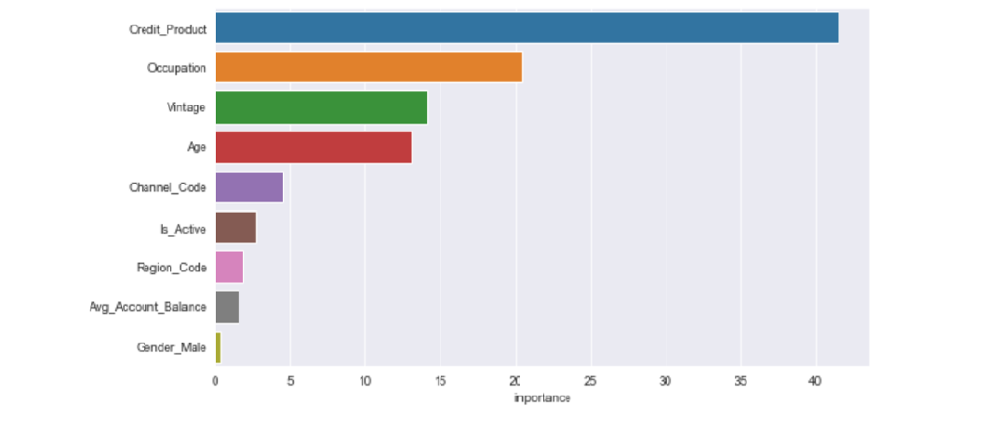

# A-Vidhya_Job-A-Thon-Solution_Approach

My approach to the problem is simple. First I look at the data and understand the problem and variables. The main thing that I noticed, the key of the Hackathon is how you deal with categorical variables and null imputation.

### Feature Engineering -
The first is how to remove the null value for the credit product variable. I decided to remove this null value with one unique value eg- "NA". Because we can not impute Yes or No without having any knowledge, so I keet it not assign a (not known) type.

To deal with categorical variables, I used 2 approaches first is One-Hot-encoder(Dummy encoding) and the second one is the Label encoder. Both methods have their pros and cons. The Algorithm that I have tried that is "Cat BOOST classifier" and CatBoost deal with categorical data in
such a way that, we just need to specify the categorical variable index and do all the necessary computation.

I did the dummy encoding with the Gender variable. For other variables, I just did the label encoding and specify their index while modeling.

### Model Building - 

First, I build the baseline model with simple logistic regression after that I chose the Cat Boost Classifier because the way cat boost deal with the categorical variables is fantastic and it also boosts your AUC-Score.

### Feature Importance - 

Below are the some Important variable accoring to my modelling. 

